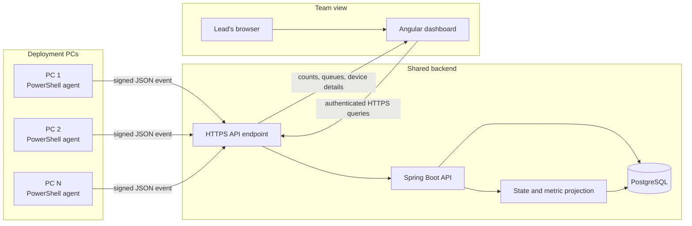
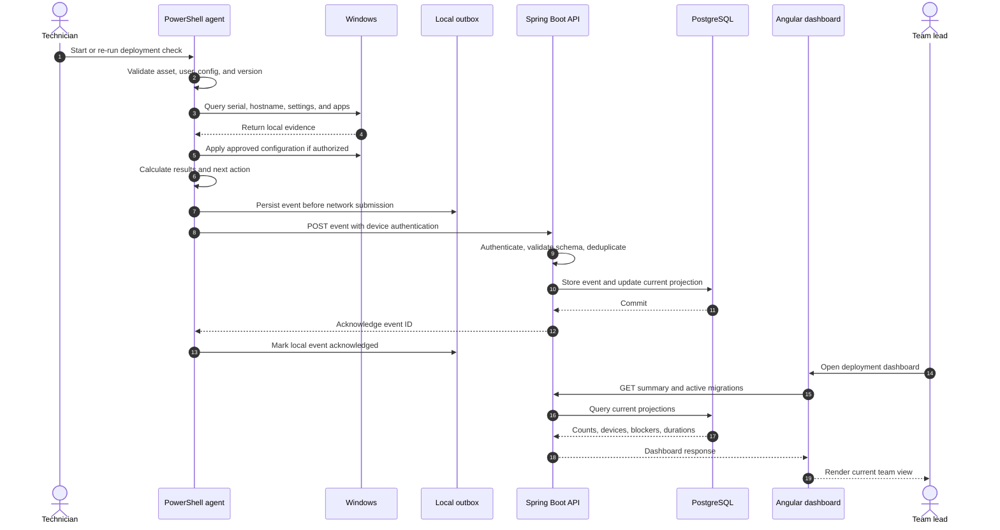
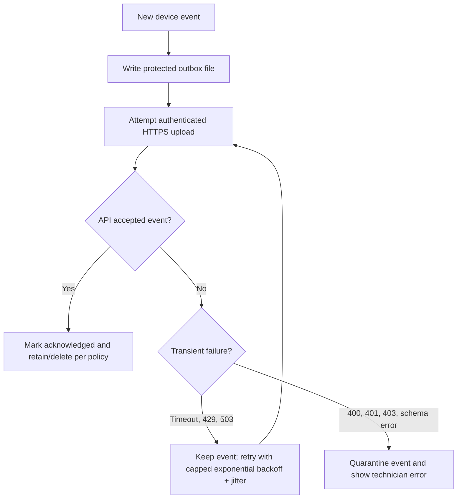
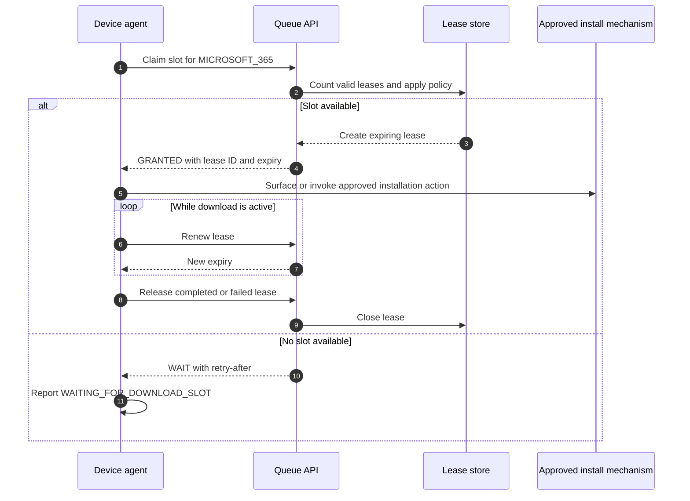

# Device-to-dashboard interaction

This guide explains how the assistant runs on each Windows PC, how results should reach the future Spring Boot service, and how the Angular dashboard should turn device events into useful operational insight.

## 1. Current behavior versus target behavior

### Intended Version 1 behavior

The planned assistant is a **one-shot local PowerShell process**:

1. A technician starts `Start-QnityDeploymentAssistant.ps1` on one PC.
2. The script reads local configuration.
3. It applies approved Windows settings on that PC.
4. It checks that PC for Company Portal, Windows App, and Microsoft 365.
5. It determines the next technician or user action.
6. It writes a log, JSON summary, and text summary to local storage.
7. The process exits.

At Sprint 1 this behavior is documented but not implemented. When implemented,
Version 1 will not contact an API, stay running as a service, monitor every PC
remotely, or update an Angular dashboard. Its configuration is expected to contain
disabled extension placeholders so those capabilities can be added without
changing the core result format abruptly.

### Recommended target

Keep the device component small:

- Run it on demand when a technician changes a deployment stage.
- Optionally re-run it on an approved schedule while a migration is active.
- Upload each new snapshot/event to the API.
- Cache unsent updates locally during network failure.
- Stop scheduled rechecks when the migration completes.

An always-running custom Windows service is unnecessary for the first shared version. A signed PowerShell agent plus an approved Scheduled Task or Intune remediation is simpler to secure, test, and remove.

## 2. High-level communication path



The PCs never send updates directly to Angular. They send them to the API. Angular also talks only to the API. PostgreSQL is never exposed to devices or browsers.

## 3. How the agent gets onto each PC

The recommended enterprise distribution path is Intune:

1. Package the signed PowerShell module, entry script, and approved configuration as an Intune Win32 application or remediation package.
2. Install immutable program files under an organization-approved location such as:

   ```text
   C:\Program Files\Qnity\DeploymentAssistant\
   ```

3. Store writable runtime state under:

   ```text
   C:\ProgramData\Qnity\DeploymentAssistant\
     Logs\
     Summaries\
     Outbox\
     State\
   ```

4. Apply ACLs so ordinary users cannot replace scripts/configuration or read records they do not need.
5. Use code signing and an approved PowerShell execution policy.
6. Use Intune detection rules to confirm the assistant version.
7. Roll out through test, pilot, and production assignment rings.

Do not use a personal USB drive or manually copy unsigned scripts between enterprise devices.

## 4. Execution identities

The design has two different identity needs.

### Machine context

Technical configuration and machine-wide detection may require Administrator or `SYSTEM` rights. A scheduled technical runner can execute in machine context to:

- read BIOS/serial information
- apply approved power/time-zone settings
- inspect machine-wide Appx and registry state
- write protected local state
- submit device evidence

### Technician/user context

Interactive work must remain visible to the signed-in technician or user:

- entering the asset tag and user email
- reviewing the next action
- recording technician validation
- recording user attestation/acceptance
- opening Windows App
- completing DuPont sign-in and MFA

A process running as `SYSTEM` should never display credential prompts or attempt to interact with the user's desktop session.

For Version 2, a good separation is:

```text
Machine runner  -> technical evidence
Angular UI      -> technician and user workflow records
```

The API links both sources using `migrationId`, `deviceId`, and `sessionId`.

## 5. What happens during one device run



The crucial reliability step is persisting the event locally **before** trying the network. If the API is unavailable, the evidence is not lost.

## 6. Technical work planned locally

The Version 1 module is expected to implement this local pattern in Sprints 2–4.

### Input and configuration

The agent will read `assistant.config.json`, check `schemaVersion`, and verify that
required rule sections exist. It will validate the asset tag and email before
changing the device.

### Device settings

The agent will use supported Windows commands:

- `Set-TimeZone` for `Eastern Standard Time`
- `powercfg.exe` with configured GUIDs and values for lid and button behavior

It must report permission or platform errors instead of attempting to bypass them.

### Application evidence

The agent will check:

- Appx packages through `Get-AppxPackage`
- standard 64-bit, 32-bit, and current-user uninstall registry locations

Each match includes the source, detected name, and version. Detection answers “is it present?” It does not prove that the user is licensed, signed in, synchronized, or able to use every feature.

### Decision

The local decision engine will evaluate configured priorities:

```text
device configuration problem
  -> Company Portal pending
  -> Windows App missing
  -> Microsoft 365 missing
  -> ready for user Cloud PC sign-in
```

The device provides a recommendation. Once Version 2 exists, the server remains authoritative for migration lifecycle transitions such as `MIGRATION_AUTHORIZED` or `COMPLETE`.

## 7. Event envelope sent to the API

Use an event envelope rather than uploading arbitrary log text:

```json
{
  "schemaVersion": "1.0",
  "eventId": "dbe070b8-d4f5-41ef-83e2-fd4625ea2e67",
  "eventType": "DEVICE_CHECK_COMPLETED",
  "sequenceNumber": 4,
  "occurredAt": "2026-07-25T17:30:00Z",
  "migrationId": "15b9d7e6-12aa-4c74-a725-11be751dcb20",
  "sessionId": "8ea4d1e9-8d4b-49a6-b67c-cd44ee03ac4e",
  "agent": {
    "version": "1.1.0",
    "configurationVersion": "2026.07.25"
  },
  "device": {
    "deviceId": "qnity-device-10427",
    "assetTag": "QNY-10427",
    "serialNumber": "REDACTED-EXAMPLE",
    "computerName": "QNY-LT-10427",
    "siteCode": "US-MA-MARLBOROUGH"
  },
  "results": [
    {
      "checkCode": "COMPANY_PORTAL_PRESENT",
      "status": "PASS",
      "observedAt": "2026-07-25T17:29:56Z",
      "evidence": {
        "source": "APPX",
        "package": "Microsoft.CompanyPortal",
        "version": "11.2.100"
      }
    }
  ],
  "nextAction": {
    "code": "INSTALL_WINDOWS_APP",
    "owner": "TECHNICIAN"
  },
  "overallStatus": "ATTENTION_REQUIRED"
}
```

Important fields:

- `eventId` uniquely identifies the event.
- `sequenceNumber` orders events from one session.
- `migrationId` connects device evidence to the business workflow.
- `deviceId` identifies the physical device independently of its user.
- `occurredAt` records when the observation happened, not when the server received it.
- `agent.version` helps identify old or incorrect detection logic.

Avoid putting long raw command output into `evidence`. Normalize it and remove secrets or unnecessary personal information.

## 8. API ingestion in Spring Boot

A suitable endpoint is:

```http
POST /api/v1/device-events
Authorization: Bearer <device-or-technician-token>
Idempotency-Key: dbe070b8-d4f5-41ef-83e2-fd4625ea2e67
Content-Type: application/json
```

Server processing order:

1. Terminate TLS at an approved gateway or the service.
2. Authenticate the caller.
3. Authorize the device/site or technician role.
4. Validate JSON against the declared schema.
5. Reject future timestamps or impossible identifiers.
6. Check the unique `eventId`/idempotency key.
7. Store the immutable event.
8. Update the current migration/device projection transactionally.
9. Recalculate server-owned state and elapsed-time fields.
10. Return an acknowledgment.

Recommended responses:

```text
202 Accepted   event stored/queued
200 OK         duplicate event already accepted
400 Bad Request invalid schema or field
401 Unauthorized missing/invalid identity
403 Forbidden identity lacks device/site access
409 Conflict   invalid workflow transition
429 Too Many Requests client must back off
503 Unavailable retain event and retry later
```

Use a database uniqueness constraint on `event_id`; application-only duplicate checks are vulnerable to races.

## 9. Authentication and trust

Never put one shared API key or client secret in every PowerShell script.

Recommended choices, subject to Qnity security approval:

### Device uploads

- Use a unique enterprise-issued device certificate for mutual TLS, or
- use OAuth 2.0 client authentication backed by a unique device certificate.

The API maps the certificate identity to an approved device/site. Certificate rotation and revocation must be supported.

### Angular users

Use Entra ID OpenID Connect/OAuth with Authorization Code + PKCE:

1. Team lead opens Angular.
2. Angular redirects to the approved Entra sign-in.
3. Entra returns tokens for the registered dashboard application.
4. Angular sends the access token to Spring Boot.
5. Spring Security validates issuer, audience, expiry, and roles.

Useful roles:

```text
DEPLOYMENT_TECHNICIAN
DEPLOYMENT_LEAD
ENDPOINT_ENGINEER
AUDITOR
```

Angular must not decide authorization by hiding buttons alone; the API enforces every permission.

## 10. Offline outbox and retry

Deployment networks are expected to be slow or temporarily unavailable.



Example retry schedule:

```text
30 seconds
1 minute
2 minutes
5 minutes
10 minutes
then every 15 minutes until the migration or retention window ends
```

Add random jitter so 30 PCs do not retry simultaneously. `401`, `403`, and invalid-schema failures should not loop forever; they need technician or engineering action.

## 11. Database model and projections

Store two forms of data:

### Immutable history

`migration_event` contains every accepted event. It answers:

- What did the device report?
- When did it report it?
- Which agent/configuration version produced it?
- What was the previous state?

### Current projection

`migration_current` and `device_current` contain the latest computed status for fast dashboards:

- current state
- next action
- next-action owner
- last contact
- time in current state
- active blocker
- current technician

The event history is the audit record; the projection is a rebuildable performance optimization.

## 12. How Angular receives insights

Angular does not calculate authoritative status from raw events. It requests server-computed views:

```http
GET /api/v1/dashboard/summary?site=US-MA-MARLBOROUGH
GET /api/v1/migrations?active=true&sort=stateEnteredAt
GET /api/v1/migrations/{migrationId}
GET /api/v1/migrations/{migrationId}/timeline
GET /api/v1/dashboard/blockers
```

Example summary response:

```json
{
  "generatedAt": "2026-07-25T17:35:00Z",
  "siteCode": "US-MA-MARLBOROUGH",
  "active": 27,
  "states": {
    "LOCAL_READINESS": 6,
    "WAITING_FOR_NETWORK": 8,
    "WAITING_FOR_USER": 4,
    "CLOUD_PC_VALIDATION": 5,
    "EXCEPTION_REMEDIATION": 4
  },
  "oldestBlockers": [
    {
      "migrationId": "15b9d7e6-12aa-4c74-a725-11be751dcb20",
      "assetTag": "QNY-10427",
      "blocker": "WINDOWS_APP_NOT_DETECTED",
      "minutesInState": 42,
      "owner": "TECHNICIAN"
    }
  ]
}
```

For the first dashboard, poll every 10–30 seconds. Polling is easier to operate than WebSockets and is sufficient for a deployment floor. Add Server-Sent Events later if near-real-time changes materially improve operations.

The lead should see:

- total active and completed devices
- counts by current state
- devices waiting longest
- next action and owner
- Company Portal/Windows App/Microsoft 365 failure counts
- last device contact
- active download slots
- errors grouped by code

These are derived insights. Individual agents send facts and events; the server aggregates them.

## 13. Download-slot interaction

The queue coordinates permission to begin an approved large download; it does not bypass Company Portal or Intune.



Leases need:

- unique lease ID
- package ID
- device and migration ID
- issued/expiry time
- last renewal
- final outcome

The server must expire abandoned leases automatically. Keep Windows App and Microsoft 365 in separate pools so a large Office deployment cannot prevent Cloud PC access.

## 14. End-to-end example

For asset `QNY-10427`:

1. A technician starts the assistant and enters the asset tag and user email.
2. The assistant creates `sessionId S1`.
3. It applies the approved power/time settings.
4. Company Portal passes; Windows App fails; Microsoft 365 fails.
5. It returns `INSTALL_WINDOWS_APP`.
6. It writes event `E1` to the local outbox.
7. The API accepts `E1` and associates it with migration `M1`.
8. The dashboard now shows `QNY-10427 — Windows App missing — technician action`.
9. The technician requests a Windows App download slot.
10. The queue grants lease `L1`.
11. The technician starts the approved Company Portal installation.
12. The assistant re-runs after installation and produces `E2`.
13. Windows App now passes; Microsoft 365 remains missing.
14. The dashboard changes the next action without the lead contacting the technician.
15. When all local checks pass, the next action becomes user Cloud PC sign-in.
16. Cloud PC and user-validation results are recorded separately through approved future workflow controls.

## 15. Implementation order

Build the shared interaction in this order:

1. Freeze Version 1 result schema.
2. Add `eventId`, `migrationId`, `deviceId`, sequence number, and agent/configuration versions.
3. Add a protected local outbox.
4. Build an API endpoint that accepts simulated events.
5. Add PostgreSQL immutable event storage and uniqueness constraints.
6. Build current-state projections.
7. Add device and dashboard authentication.
8. Add PowerShell upload with retry and acknowledgment.
9. Build Angular summary, queue, detail, and timeline views.
10. Add polling, then evaluate whether Server-Sent Events are needed.
11. Pilot uploads without download coordination.
12. Add lease-based download slots only after event flow is reliable.

Do not add the Angular dashboard first. Without a stable event contract and server-owned state, the dashboard will merely display inconsistent local interpretations.
