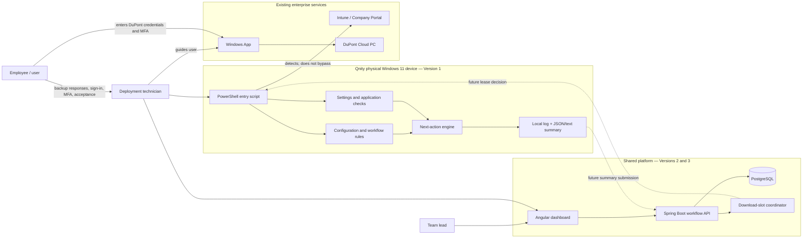
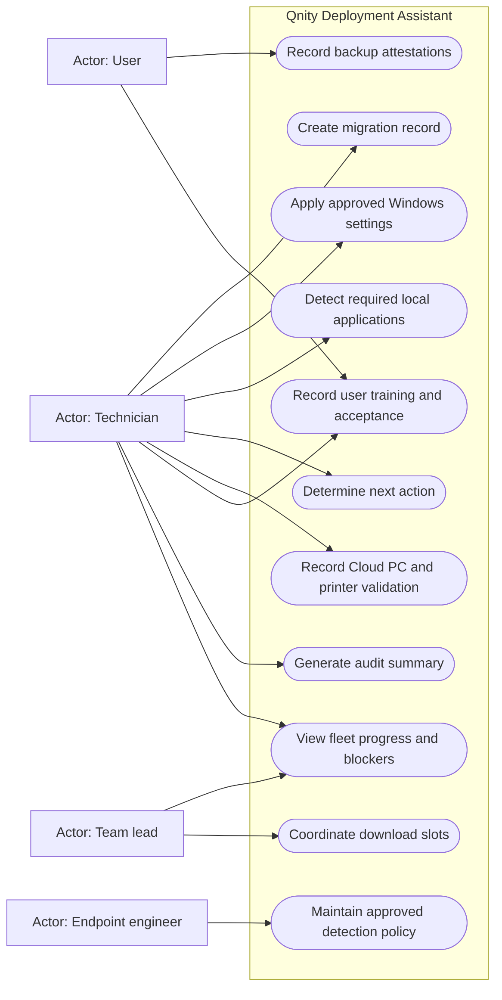
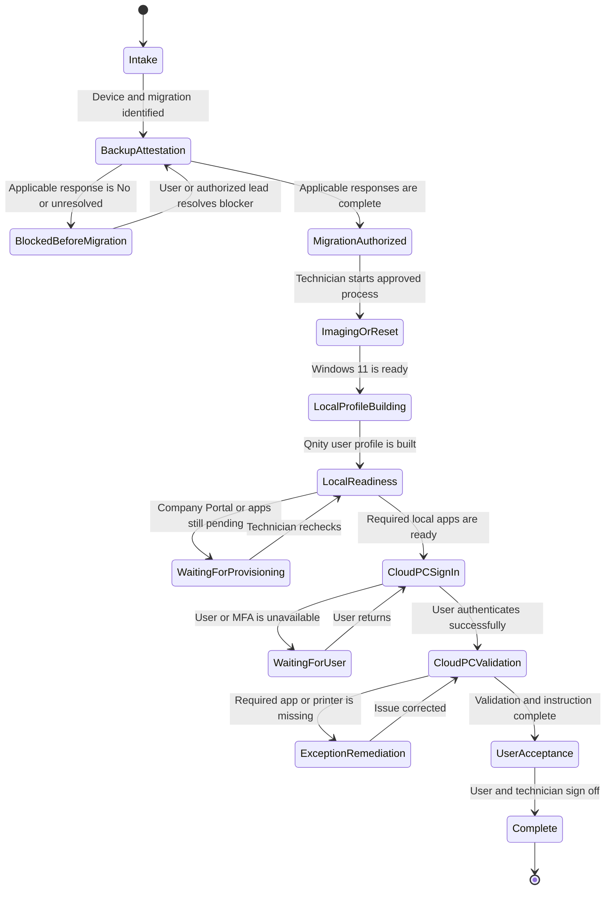
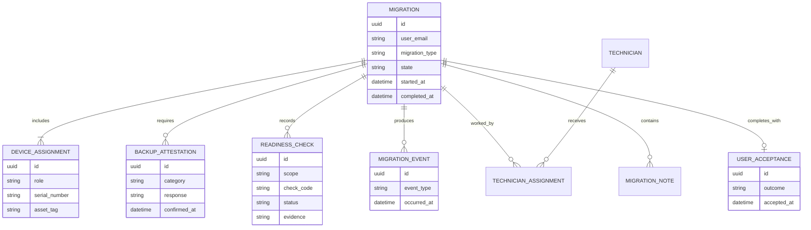

# Qnity Deployment Assistant implementation guide

This guide explains what the project solves, how the pieces fit together, and the order in which to build them. Use it as the shared plan when working with another developer or Codex agent.

## 1. Understand the problem first

The project is not primarily an application installer. It is a controlled migration assistant for a repetitive Windows 11 deployment workflow.

Today, a technician must:

1. Identify the user, old device, replacement device, and migration type.
2. Confirm that the user has reviewed the required backup categories.
3. Rebuild, replace, or reset the device through an approved process.
4. Wait for the Qnity profile and enterprise applications to appear.
5. Repeatedly check Company Portal, Windows App, and Microsoft 365.
6. Help the user reach their DuPont Cloud PC.
7. Validate OneDrive, Outlook, Teams, Ricoh printing, and other required services.
8. Record who worked on the device, exceptions, and user signoff.

At peak time, many devices compete for limited network bandwidth. Technicians cannot easily see which device is waiting, failed, ready for a user, or consuming a large download.

The project therefore solves four operational problems:

- **Consistency:** every technician follows the same controlled workflow.
- **Visibility:** each device has a clear state, next action, owner, and history.
- **Efficiency:** the computer performs repeatable checks and produces documentation.
- **Bandwidth coordination:** later, a server limits concurrent large downloads.

It does not replace Intune, Company Portal, Windows App, Cloud PC, enterprise identity, security approval, or technician judgment.

## 2. Keep four kinds of truth separate

This distinction is central to the design:

| Kind of truth | Example | Who or what may assert it |
|---|---|---|
| Technical fact | Company Portal package is detected | PowerShell assistant |
| User attestation | Chrome bookmarks were backed up | User |
| Technician validation | User was shown how to launch Cloud PC | Technician |
| Enterprise decision | Device may be reset despite an exception | Authorized lead/policy |

A technical check must never be converted into user consent. For example, detecting OneDrive does not prove that all required data is synchronized and does not authorize a wipe.

## 3. Target architecture

The local assistant is useful by itself in Version 1. Versions 2 and 3 add shared visibility and coordination without replacing enterprise management systems.



The most important boundary is the gap between the local device and the Cloud PC. A local check cannot prove that a Cloud PC application or printer is working.

## 4. Main use cases

Mermaid does not have a native UML use-case shape, so this diagram uses a system boundary with actor-to-use-case connections.



Credentials and MFA are deliberately absent as system use cases. The user enters them directly into Microsoft-controlled sign-in experiences.

## 5. End-to-end workflow



`WAITING_FOR_NETWORK`, `FAILED`, and `ESCALATED` should be available from any operational stage, with a reason and timestamp.

## 6. Build it in controlled increments

### Step 1 — Validate the field workflow

Meet with the team lead or endpoint owner and review [`field-workflow-reference.md`](field-workflow-reference.md).

Confirm:

- the exact migration types
- which backup responses block work
- the approved time-zone and power settings
- package identities for Company Portal, Windows App, and Microsoft 365
- the definition of a complete Cloud PC
- the intended OneDrive, Teams, and Ricoh outcomes
- who may approve exceptions
- retention rules for user identity, serial numbers, signoff, and notes

**Deliverable:** an approved checklist and a list of unresolved questions.

### Step 2 — Define the vocabulary and states

Create stable codes before building screens or APIs:

```text
MigrationType:
  REPLACEMENT
  USB_REBUILD
  WINDOWS_RESET

CheckStatus:
  NOT_CHECKED
  PASS
  FAIL
  NOT_APPLICABLE
  BLOCKED
  EXCEPTION

OperationalState:
  WAITING_FOR_USER
  WAITING_FOR_NETWORK
  FAILED
  ESCALATED
```

Use codes in JSON and databases; keep technician-facing wording configurable.

**Deliverable:** versioned configuration and JSON schema.

### Step 3 — Set up safe development environments

Use four environments:

1. **Developer simulation:** fake application results; no Windows changes.
2. **Approved Windows test device:** representative hardware and test accounts.
3. **Pilot:** a small number of real migrations with technician supervision.
4. **Production:** signed, change-controlled artifacts with approved enterprise
   identity, storage, monitoring, retention, and rollback.

Never develop destructive imaging/reset behavior against a user device. The assistant should begin after the approved imaging process in Version 1.

**Deliverable:** test-device inventory, test identities, and approved signing/execution policy.

### Step 4 — Complete Version 1 input and configuration

Sprint 2 implements the first bounded Version 1 files:

- `powershell/Start-QnityDeploymentAssistant.ps1` as the local entry point
- `powershell/config/assistant.config.json` for input, device settings, and
  disabled future integrations
- `powershell/config/assistant.config.schema.json` for strict configuration
  validation
- a versioned PowerShell module under `powershell/src/`

Application rules, next-action decisions, persistent logs, and summaries remain
planned for Sprint 3. Sprint 4 freezes their Version 1 contract and packages the
signed-script layout.

Refine input to collect only the data required for Version 1. Keep new serial numbers, backup attestations, and signoff out until their storage and authorization rules are approved.

Sprint 2 validates:

- a provisional configurable asset-tag format
- email format
- configuration schema version
- all required device-setting and safety fields

Required application rules and safe output locations are added in their
authorized later sprints.

**Acceptance status:** implemented and covered by the Sprint 2 PowerShell test
harness; real Windows validation remains pending.

### Step 5 — Apply and verify device settings

For each approved setting:

1. Check that the script is running on Windows.
2. Check for Administrator rights.
3. Read the desired value from configuration.
4. Apply it through a supported Windows command.
5. Query the value again where possible.
6. Record `Pass`, `Fail`, `Skipped`, or `Error`.

`-WhatIf` must explain proposed changes without modifying the device.

**Acceptance criterion:** the script is idempotent—running it twice produces the same desired state without harmful side effects.

### Step 6 — Detect applications without bypassing management

For Company Portal, Windows App, and Microsoft 365:

1. Query approved Appx package identities.
2. Query approved uninstall-registry display names.
3. Record the matching name, version, and detection source.
4. Treat “not detected” as a workflow state, not permission to sideload software.
5. Direct the technician to Company Portal or the approved escalation path.

Because application identifiers vary by tenant and package version, keep detection rules in configuration.

**Acceptance criterion:** results match Company Portal/Intune evidence on every supported test image.

### Step 7 — Implement the next-action engine

Evaluate one blocker at a time in business priority:

```text
device configuration error
  -> Company Portal pending
  -> Windows App missing
  -> Microsoft 365 missing
  -> user ready for Cloud PC sign-in
```

Return both:

- a stable code, such as `INSTALL_WINDOWS_APP`
- technician-friendly instructions

Keep the decision engine separate from detection so future API/dashboard code can reuse the same rules.

**Acceptance criterion:** every combination of application results has a deterministic next action.

### Step 8 — Generate trustworthy records

Each run should create:

- one correlation/session ID
- UTC start and completion timestamps
- device and user identifiers
- every check and its evidence
- final status
- next-action code
- a local operational log
- JSON for machines and text for technicians

Do not write credentials, MFA codes, tokens, recovery keys, or unnecessary personal information.

**Acceptance criterion:** an independent technician can understand what happened using only the summary and log.

### Step 9 — Test Version 1

Test in layers:

1. Configuration parsing and input validation.
2. Decision-engine unit tests.
3. Simulation scenarios:
   - everything ready
   - Company Portal pending
   - Windows App missing
   - Microsoft 365 missing
   - configuration error
4. Windows test-device runs with `-WhatIf`.
5. Approved elevated runs.
6. Repeated runs to verify idempotence.
7. Standard-user runs to verify safe permission failures.

**Acceptance criterion:** tests pass and the output agrees with manual inspection.

### Step 10 — Pilot Version 1 operationally

Run a small deployment wave. Measure:

- average technician attention time per device
- time waiting for Company Portal
- most frequent next action
- false positive/negative application detections
- number and cause of escalations
- completeness of summaries

Do not measure success only by device count; measure avoided rework and accurate handoffs.

**Acceptance criterion:** the lead approves the workflow and no safety or documentation regression is found.

### Step 11 — Build the Version 2 Spring Boot API

After the local contract is stable:

1. Create a Spring Boot service with PostgreSQL.
2. Add enterprise SSO and roles.
3. Model migrations, devices, attestations, checks, events, technicians, acceptance, and notes.
4. Accept Version 1 summaries through an idempotent endpoint.
5. Validate state transitions on the server.
6. Store append-only events for audit history.
7. Return the authoritative migration state and next action.

Initial endpoint shape:

```http
POST  /api/v1/migrations
GET   /api/v1/migrations/{id}
POST  /api/v1/migrations/{id}/device-summaries
POST  /api/v1/migrations/{id}/attestations
POST  /api/v1/migrations/{id}/events
PATCH /api/v1/migrations/{id}/state
GET   /api/v1/migrations?state=WAITING_FOR_NETWORK
```

**Acceptance criterion:** submitting the same session twice does not create duplicate checks or events.

### Step 12 — Build the Version 2 Angular dashboard

Create views for:

- deployment queue
- device/migration detail
- blockers and exceptions
- technician workload
- state history
- final signoff readiness

Display precise states rather than ambiguous colored checkboxes. Make the next required human action obvious.

**Acceptance criterion:** a lead can answer “where is every device stuck, for how long, and who owns the next action?” without contacting each technician.

### Step 13 — Add Version 3 download-slot coordination

Use server-issued leases:

1. Device requests a slot for a package.
2. Server applies package-specific concurrency limits.
3. Server returns a lease ID and expiration.
4. Device renews while the approved download is active.
5. Device releases on completion/failure.
6. Expired leases return to the pool automatically.

Keep separate pools for Windows App and Microsoft 365. Windows App normally receives higher priority because it unlocks Cloud PC access.

**Acceptance criterion:** simultaneous large downloads remain within the site limit and abandoned devices cannot hold slots forever.

### Step 14 — Expand checklist coverage carefully

Only after policy and evidence are approved, add:

- serial-number comparison
- backup attestation capture
- OneDrive and Outlook checks
- Cloud PC application validation
- Ricoh mapping/driver validation
- Teams account-context validation
- user instruction acknowledgments
- technician list, notes, and user acceptance

Prefer detection when it is reliable. Otherwise record an explicit technician or user attestation and label it as such.

## 7. Planned data relationships



Do not store a signature image unless the organization's legal, privacy, and retention owners approve it. An authenticated acceptance event may be preferable.

## 8. How the files map to the design

| File | Responsibility | Status |
|---|---|---|
| `powershell/Start-QnityDeploymentAssistant.ps1` | Collect parameters and start one local run | Sprint 2 implemented |
| `powershell/config/assistant.config.json` | Input, approved-setting baseline, and disabled future integrations | Sprint 2 implemented |
| `powershell/config/assistant.config.schema.json` | Strict configuration contract | Sprint 2 implemented |
| `powershell/src/Qnity.DeploymentAssistant.psm1` | Configuration/input/settings now; detection, decisions, logs, and summaries later | Sprint 2 partial implementation |
| `powershell/src/Qnity.DeploymentAssistant.psd1` | Versioned PowerShell module metadata | Sprint 2 implemented |
| `powershell/samples/*.json` | Safe simulated device states | Sprint 2 implemented; app states later |
| `powershell/tests/Invoke-Tests.ps1` | PowerShell behavior checks | Sprint 2 implemented and extended through Sprint 4 |
| `docs/architecture.md` | Technical boundaries and future service design | Sprint 1, maintained incrementally |
| `docs/field-workflow-reference.md` | Transcribed field requirements and open questions | Sprint 1 input |

## 9. Suggested Codex handoff method

Give a Codex agent one bounded milestone at a time. Include:

1. the exact files it may change
2. the relevant acceptance criteria from this guide
3. required tests
4. the safety boundary
5. a request to report assumptions rather than silently invent policy

Example:

```text
Implement the next-action decision tests for Version 1.
Use docs/implementation-guide.md Step 7 as the requirement.
Do not change application installation behavior or add network calls.
Add cases for every missing-application combination, run the tests,
and report any ambiguity in the configured priority.
```

Before accepting an agent's work, ask:

- What requirement did this change satisfy?
- What assumptions were made?
- What tests prove the behavior?
- Could the change collect secrets or authorize destructive work?
- Does it preserve the difference between detection, attestation, and approval?
- What remains manual?

## 10. Definition of project success

The project succeeds when technicians spend less time repeatedly checking machines, leads can see all blockers in one place, large downloads no longer overwhelm the site, and every migration has a trustworthy history.

It fails if it makes unsafe wipe decisions, collects credentials, hides exceptions behind a green status, bypasses enterprise controls, or produces records that cannot distinguish computer evidence from human attestation.
